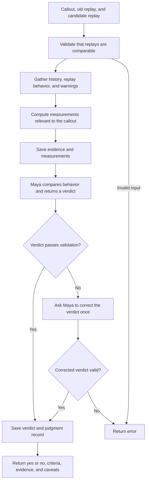

# How Maya Works

Maya checks whether a candidate Copilot replay fixed the problem described in the original callout. It compares the old and candidate behavior for the same job and turns.

- **Input:** An existing pair of replays, submitted through `POST /maya/judge` or `yarn maya:judge <prepared-replays.json>`. Maya does not run the replays itself.
- **Evidence:** Historical behavior, old replay, and candidate replay, with references to messages, guard replies, events, and actions. Prompt edits and Theo's diagnosis are excluded.
- **Judgment:** Application code computes measurements such as message counts, silence, flags, and escalations. Maya uses those measurements and the evidence to assess the callout, with one model step per attempt and no tools.
- **Validation:** Checks the verdict structure, evidence references from both replays, supplied measurement values, and agreement between the criteria and final verdict. Every criterion must pass for `fixed: true` and `verdict: "yes"`.
- **Output:** Evidence, measurements, verdict, and judgment history are saved under `runs/maya-<jobId>-<number>/` by default. Maya evaluates the fix; it does not edit prompts or approve deployment.

Source: [runner](../src/mastra/maya/runner.ts), [evidence builder](../src/mastra/maya/evidence-packet.ts), [measurements](../src/mastra/maya/measurements.ts), and [verdict validator](../src/mastra/maya/verdict-validator.ts).
