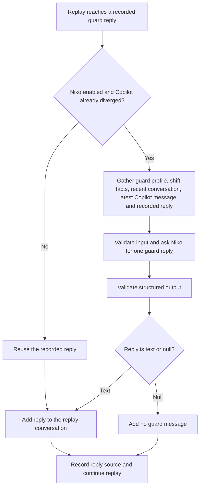

# How Niko Works

Niko simulates a security guard's replies when a candidate Copilot replay stops matching the recorded shift. It keeps later replies coherent with the changed conversation.

- **When it runs:** `callNiko` defaults to `true`. The replay detects divergence by comparing Copilot messages, silence, flags, notes, and escalations with history. Once detected, Niko handles subsequent recorded guard replies.
- **How it replies:** One model step using `openai/gpt-5-mini`, with no tools. Niko is instructed to preserve shift facts and the guard's style, reuse the recorded reply when suitable, adapt it minimally otherwise, or return `null` for silence.
- **What happens next:** A `null` reply is omitted. If all guard replies for a guard-triggered turn are omitted, that Copilot turn is skipped. Non-chat shift events remain unchanged.
- **Validation and logging:** Invalid input or output, or a model failure, stops the replay with an error. Successful replay logs label replies as `historical` or `simulated` and retain the original reply as evidence.

Source: [replay service](../src/copilot-simulation/copilot-simulation.service.ts), [Niko simulator](../src/mastra/niko/simulator.ts), [instructions](../src/mastra/niko/instructions.ts), and [agent configuration](../src/mastra/agents/niko-agent.ts).
