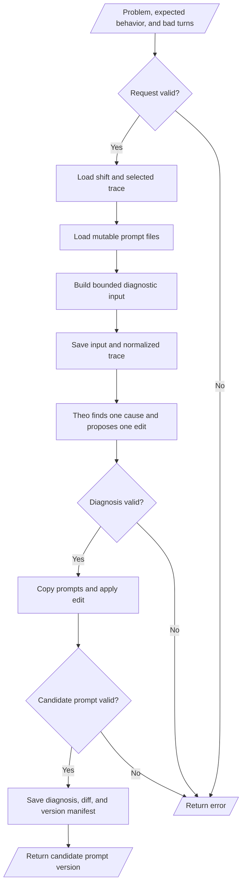

# How Theo Works

Theo turns a reported Copilot problem into one validated, versioned prompt change. It does not decide whether the change fixed the problem; Maya does that after replay.

## Important Boundaries

- Theo receives selected trace evidence, shift context, and mutable prompt files.
- Theo proposes exactly one edit in `prompts/core/` or `prompts/instructions/`.
- Validation checks evidence references, target file, exact old text, and resulting prompt structure.
- Original prompts remain unchanged. Theo creates a separate candidate version.
- Saved artifacts show the input, diagnosis, proposed edit, prompt diff, and candidate version.
- The candidate version goes to Copilot replay, then Maya judges the result.
